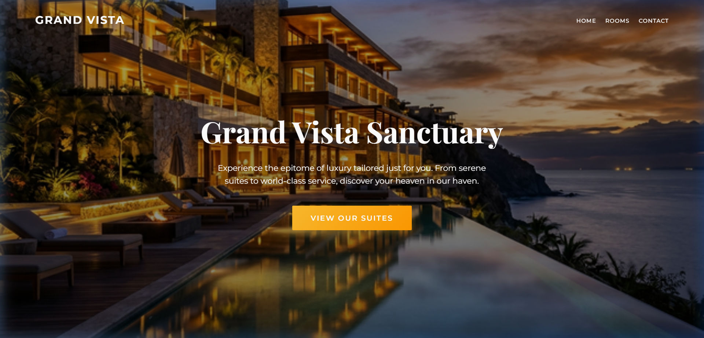
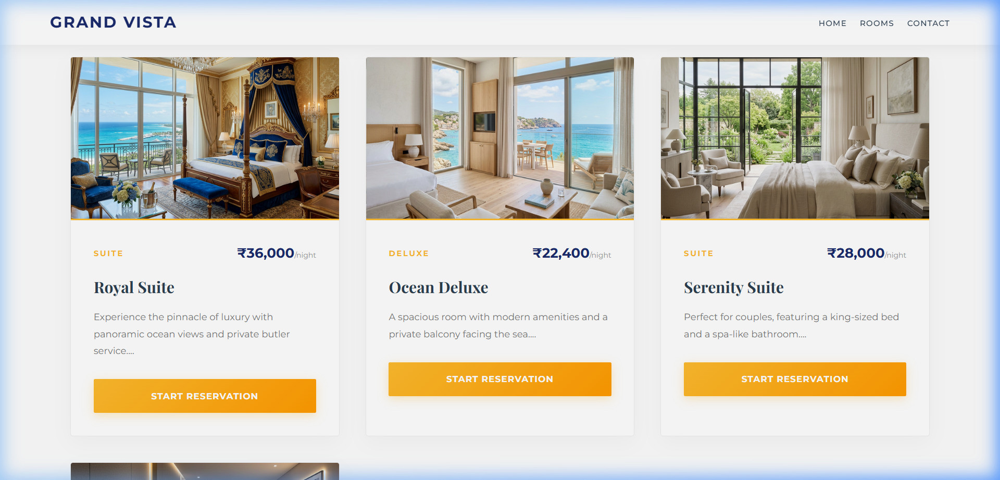
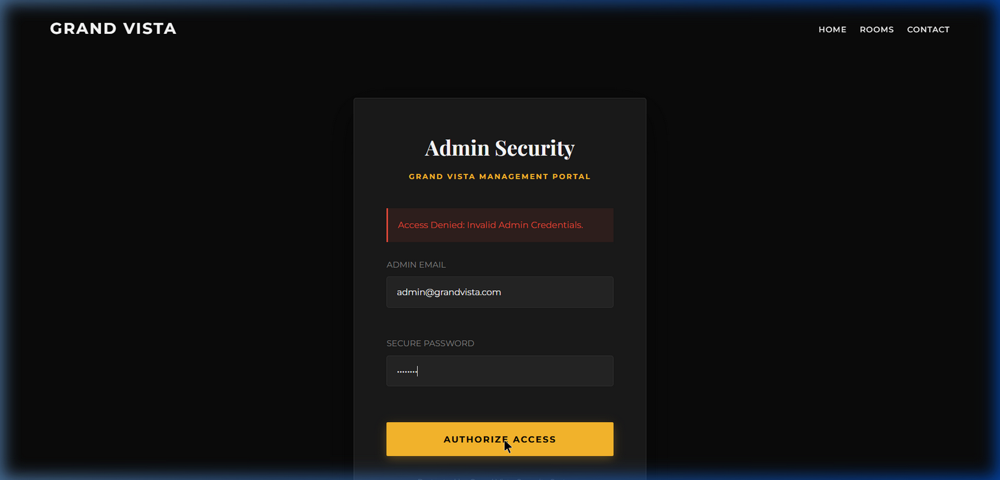

# Grand Vista Hotel Booking System

A full-stack hotel booking and management application built with PHP and MySQL. The system is designed to handle both customer reservations and backend administrative operations.

## Architecture

- **Frontend:** HTML5, CSS3, Vanilla JavaScript
- **Backend:** PHP
- **Database:** MySQL
- **Design Pattern:** Custom MVC-inspired structure with standalone asynchronous API endpoints.

## Core Features

- **Authentication System:** Gated booking flow requiring user registration and login to view availability and make reservations.
- **Admin Dashboard:** Centralized management hub for room inventory, gallery updates, and user data oversight.
- **State Management:** Real-time database tracking with specialized UI indicators (e.g., color-coded status highlighting for cancelled or active bookings).
- **Asynchronous APIs:** Standalone PHP endpoints supporting asynchronous frontend requests without full page reloads.

## Application Screenshots

### Customer View

  
  

### Admin View

  

## Setup Instructions

1. Clone the repository into your local web server environment (e.g., `htdocs` for XAMPP).
2. Create a MySQL database and import the provided `.sql` schema file.
3. Update `config.php` (or relevant database connection file) with your local database credentials.
4. Launch the application via `localhost`.

---
*Created by Anup Shet*
